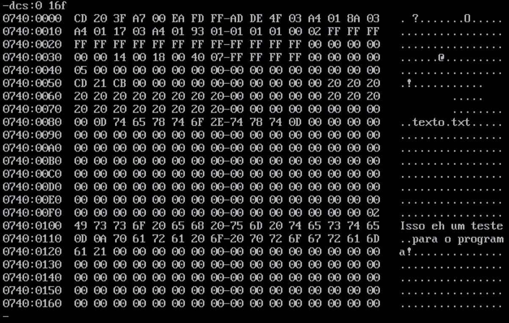

##Utilizando o DEBUG para visualizar o conteúdo de um arquivo

###Analisando o conteúdo de um arquivo:

```
c:\>debug texto.txt
-dcs:0 16f
```



###Irá verificar os dados entre 0000h-016fh

###para sair: 
-q

